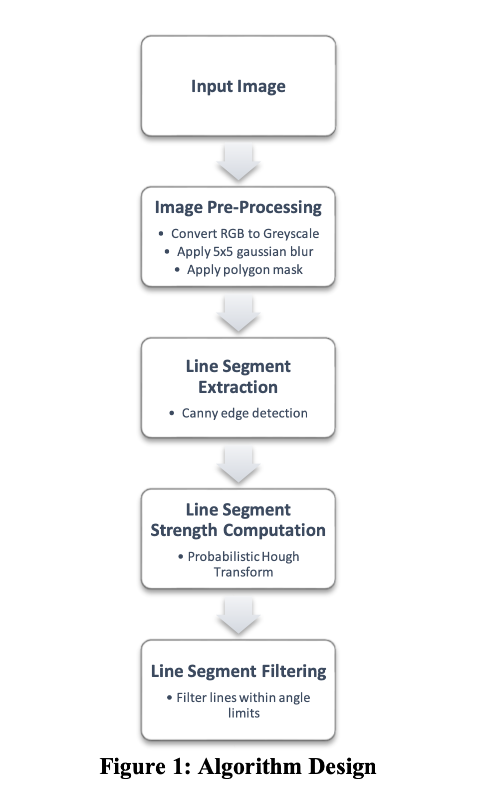
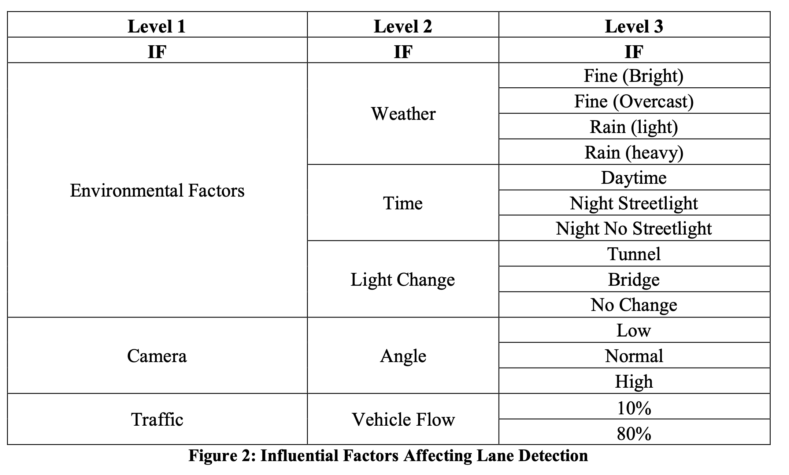
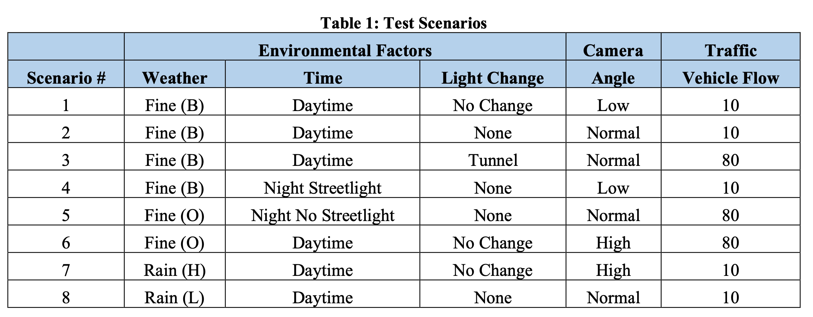
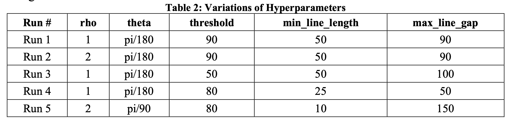
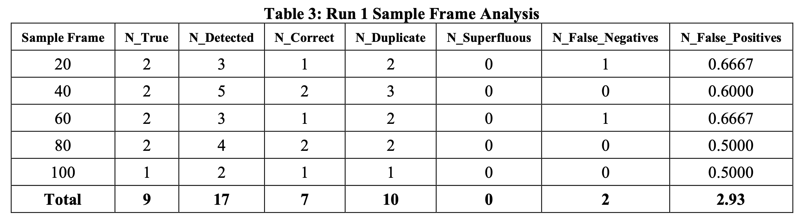
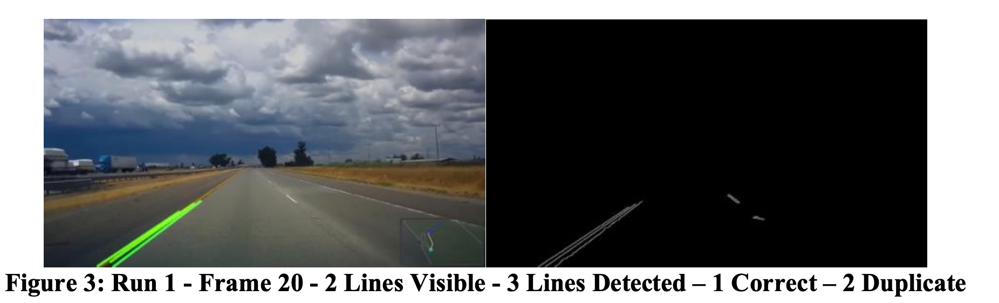
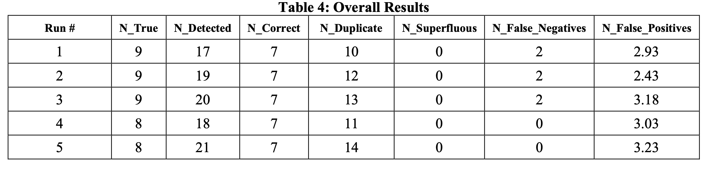
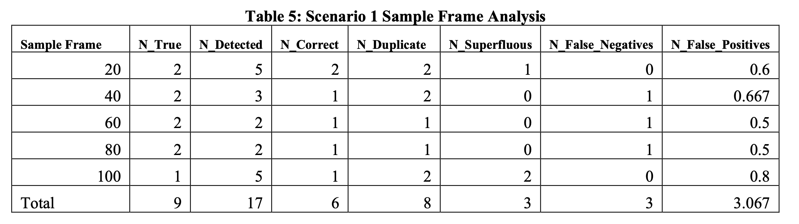
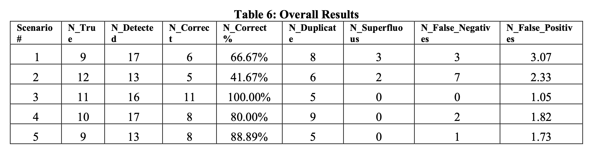

# camera-parameter-finder
camera parameter finding module for my colllege assignment using OpenCV

# Evaluating Lane Detection Algorithm in Multiple Scenarios Using Hough Transform

James O&#39;Connor - _IT Sligo_

**Abstract**

In this paper the application of an edge detection algorithm was explored using Canny edge detection and the Hough Transform. The Hough Transform algorithm, and its associated hyperparameters was tested in eight distinct road scenarios using a test framework. Results were compared to determine the optimal hyperparameters as well as determining the effect of influential factors on the performance.

# Introduction

Edge detection algorithms have been used for a number of years for various applications . One of the key applications of edge detection algorithms in the autonomous vehicles industry is lane detection. Lane detection is the critical component in the application of various features in intelligent vehicles. Examples of these include lane detection warning (LDW), lane departure prevention (LDP) as well as enabling autonomous and driverless vehicles to perceive their environments and navigate. LWD and LDP systems have been shown to reduce crashes by 26% and 32% respectively (NHTSA, 2016) and have become such a critical component of intelligent vehicles that they will become mandatory in all vehicles within the EU by 2022 (European Parliament, 2019).

In many computer vision problems concerning intelligent vehicles, such as pedestrian and object detection, sensor fusion of cameras with ranging sensors such as LiDAR, RADAR can complement the overall object detection capabilities of the intelligent vehicles. Similarly, they can act as a redundancy in the event of low visibility conditions or a compromised camera sensor. However, lane detection algorithms rely solely on the input from the camera (or cameras) to perform a classification. Adverse weather conditions affect the cameras range of visibility (snow, rain, fog), the ability to find occluded road markings (snow) or contrast (sunny). Therefore, developing a robust, high availability lane detectors using camera input is critical to the safety and reliability of these systems. Code for this paper can be found [here](https://github.com/jameseoconnor/lane-detection-opencv).

# Review of Literature

## Algorithm Design

The original edge finding algorithm was proposed by John Canny (Canny, 1986) uses the first derivative of the change between pixels in all four directions to calculate the gradient and direction of an edge. The Hough Transform (US Patent No. US3069654A, 1960) can be used on top of this to distinguish the presence of lines within these edges, based on a number of hyperparameters.

## Testing

There does not seem to be a consensus on how to test lane following algorithms, however there is a number of datasets that are used as benchmarks. One of these is the KITTI dataset which includes 289 training and 290 test images that have been labelled and can be used to benchmark lane detection algorithms. Bush &amp; Esposito (2010) adopted a simple testing approach to evaluation the performance by manually assigning the classification a score from 0 to 3, 3 being excellent and 0 being detrimental. Nguyen, Pham, Kim, &amp; Jeon (2008) defined a test framework for the accuracy of line detection by Hough Transform and involves counting the number of lines predicted and comparing to the true value and calculates the false positives and negatives.

# Method

## Algorithm Design

The algorithm design was based on Yoo, Lee, Park, &amp; Kim (2017) and code by pknowledge (2020) and is outlined in Figure 1. This algorithm was be repeated for each frame of the video The sample videos ran at 24 FPS and resolution 720p on a 2 GHz Quad-Core Intel Core i5.

**Scenario Generation**

As the goal of this paper is to investigate the efficacy of a lane detection algorithm in different scenarios, the initial step was to design the test scenarios based on the video selected for analysis. Xia, Duan, Gao, Hu, &amp; He (2018) provide a test scenario design framework for intelligent vehicles that ensures adequate coverage and effectiveness. The framework works as follows: decide the influential factors, rank them by degree of importance, create combinatorial test cases for all of these factors and then group them into larger test cases. The figures below were taken from the paper, which lists a number of influential factors including environment, road, traffic and vehicle dynamics. However, for the sake of brevity, as well as not having access to vehicle dynamics data, the factors were not weighted and only environment camera and traffic conditions were considered as test case variables.

From these influential factors, eight scenarios were derived as seen in Table 1. These test scenarios were designed to give a high coverage of each influential factor.

## Algorithm Testing

The algorithm was tested under **two conditions** :

1. Altering the hyper parameters over multiple runs of the same video to determine the effects of hyperparameters on the same scenario.
2. Altering the scenario over multiple runs to test the robustness of the algorithm.

To test the first condition (i), the following hyper parameters permutations for the Probabilistic Hough Line were used.

The outcome of the optimal hyperparameter permutation from condition (i) was used to test the second condition (ii). As this research is being conducted on an unlabelled dataset, the KITTI dataset could not be used to benchmark performnce without extensive image labelling. The approach by Nguyen, Pham, Kim, &amp; Jeon (2008) was used to measure the correctness of the algorithm. This framework involves counting the number of lines predicted in a frame and comparing to the true value (N = Number of Lines). Equations for each column are outlined in the original paper. Sample frames were taken at 20, 40, 60, 80 and 100 frames so they could be analysed to evaluate the performance of the algorithm in both condition (i) and condition (ii).

# Results &amp; Discussion

## Condition (i) - Effect Of Hyper Parameters

A total of five runs were completed using the Hough Lines hyper parameters outlined in Table 3.

Each run identified the same number of correct line predictions. Run 1 performed the best as it had the lowest duplicate line rate and lowest false positive rate. Lowering the threshold increased the false positive rate as seen in Run 3. Increasing rho and lowering theta also increased the false positive rate as seen in Run 5.

## Condition (i) - Effect Of Scenarios

Using the parameters from condition (i), the same approach was taken to test the in the eight scenarios outlined in Table 6.

Scenario 3 and scenario 8 scored the highest overall. Interestingly, scenario 8 included light rain but scored the same as a bright day. Clear road markings had a very positive impact on detection. Heavy rain had a very negative impact as seen in scenario 7. Normal to High angled camera angles scored better than low angled shots due to more of the line being available to classify. Scenario 2 had a number of bends and direct sunlight exposure which resulted in a low classification score.

# Conclusion and Future Research

To conclude, the research showed that the scenario and the Hough Transform hyperparameters both affect the performance of the algorithm, but the former to a much larger extent. Ultimately there are a multitude of variables to contend with, making generalizing a model that works in all situations very difficult. There are a number of directions this research can take. In terms of test case generation, a wider set of test cases can be undertaken to include other environmental factors such as vehicle dynamics, road marking definition and traffic. Different colour scales such as HSV (hue, saturation, value) or HLS (hue, lightness, saturation) could be tested during image pre-processing phase of the algorithm to better expose the road markings. Logic to determine the vanishing point could be added to the algorithm to dynamically set create a dynamic mask to optimise the computation area of the images on which we run Canny detection and Hough Transform. Similarly, experiments could be conducted to determine the optimal parameters for each scenario and a scenario detection algorithm using a Convolutional Neural Network (CNN) could be used to detect the scenario type and set the parameters accordingly.

# Bibliography

Bush, F. N., &amp; Esposito, J. M. (2010). Vision-based lane detection for an autonomous ground vehicle: A comparative field test. _Southeastern Symposium on System Theory (SSST)_.

Canny, J. (1986). A Computational Approach to Edge Detection . _IEEE Transactions on Pattern Analysis and Machine Intelligence_.

European Parliament. (2019, 02 20). _www.europarl.europa.eu._ Retrieved 03 10, 2021, from https://www.europarl.europa.eu/news/en/press-room/20190220IPR27656/safer-roads-more-life-saving-technology-to-be-mandatory-in-vehicles

Hough, P. (1960). _US Patent No. US3069654A._

Nguyen, T. T., Pham, X. D., Kim, D., &amp; Jeon, J. W. (2008). A test framework for the accuracy of line detection by Hough Transforms. _2008 6th IEEE International Conference on Industrial Informatics._ Daejeon: IEEE.

NHTSA. (2016). _POTENTIAL SAFETY BENEFITS OF LANE DEPARTURE WARNING AND PREVENTION SYSTEMS IN THE U.S. VEHICLE FLEET ._ Retrieved 03 12, 2021, from https://www-esv.nhtsa.dot.gov/Proceedings/24/files/24ESV-000080.PDF

pknowledge. (2020). _Road Lane Line Detection with OpenCV_. Retrieved from GitHub: https://gist.github.com/pknowledge/86a148c6cd5f0f2820ba81561cc00a8e

Xia, Q., Duan, J., Gao, F., Hu, Q., &amp; He, Y. (2018). Test Scenario Design for Intelligent Driving System Ensuring Coverage and Effectiveness. _International Journal of Automotive Technology volume_.

Yoo, J. H., Lee, S.-W., Park, S.-K., &amp; Kim, D. H. (2017). A Robust Lane Detection Method Based on Vanishing Point Estimation Using the Relevance of Line Segments. _IEEE TRANSACTIONS ON INTELLIGENT TRANSPORTATION SYSTEMS_.